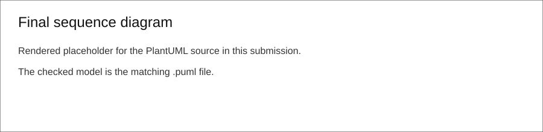
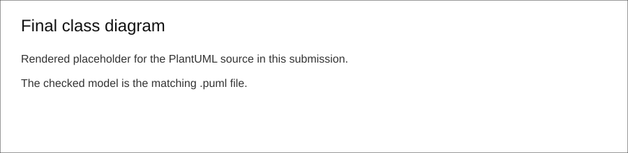
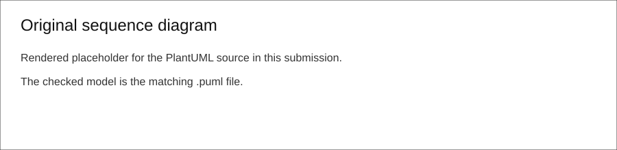
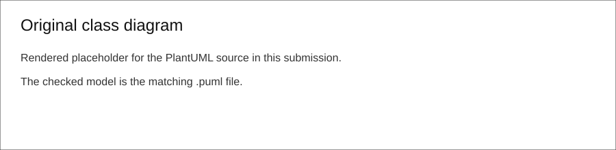

# SIS #02 — AI-Assisted UML Modeling: University Course Registration

## 1. Scope and assumptions

**Scope:** Model course catalog browsing and registration for one student choosing one existing course offering in one semester. The model excludes payments, prerequisites, timetable clashes, waiting lists and cancellation.

**Assumptions:**

1. Catalog browsing displays availability only; it never reserves a seat or changes enrollment data.
2. Registration uses one atomic final operation for duplicate check, capacity check and enrollment creation.

## 2. User stories and acceptance criteria

### US-01 — Browse offerings

**US-01:** As a student, I want to browse course offerings for one semester, so that I can see the course code, title, offering and current places before choosing.

- **AC-01** (R1): Given a semester with available course offerings, When the student opens the catalog, Then the catalog shows each course code, title, offering and available places.
- **AC-02** (R1): Given the student only browses the catalog, When availability is displayed, Then no seat is reserved and no Enrollment is created.

### US-02 — Register for an offering

**US-02:** As a student, I want to register for a selected offering, so that I receive an enrollment when the offering still has capacity and I am not already enrolled.

- **AC-03** (R2, R4): Given an offering has places left and the student is not already enrolled, When the student requests registration, Then the system rechecks capacity, creates exactly one Enrollment, updates availability and returns confirmation.
- **AC-04** (R2, R4): Given an offering has exactly one place left and the student is not already enrolled, When the student requests registration, Then the system creates exactly one Enrollment and the available places become zero.

### US-03 — Receive a clear rejection

**US-03:** As a student, I want registration to be rejected with a reason when it cannot be accepted, so that I know whether the offering is full or I am already enrolled.

- **AC-05** (R2, R5): Given the catalog earlier showed a place but the offering is now full, When the student requests registration, Then the system rejects the request as course full and creates no Enrollment.
- **AC-06** (R3, R5): Given the same student already has an Enrollment for the offering, When the student requests registration again, Then the system rejects the request as already enrolled and leaves the count unchanged.

## 3. Sequence diagram



**Participants:** Student is the actor who browses and requests registration. CatalogUI represents the screen or boundary used by the student. RegistrationService coordinates catalog display and registration decisions. CourseOffering stores semester capacity and current count. EnrollmentRepository checks existing enrollments and creates the new Enrollment record.

**Atomic operation:** The atomic operation is the grouped final registration check after `register(studentId, offeringId)`: `findEnrollment`, `currentAvailability`, the guarded decision and `createEnrollment` when the success guard is true. This matters because the earlier catalog view is only information for the student and reserves nothing.

**Where the Enrollment is created:** The Enrollment is created by `createEnrollment(studentId, offeringId)` sent from RegistrationService to EnrollmentRepository inside the success branch. The produced domain object is the Enrollment class shown in section 4.

**Technical lifelines:** CatalogUI, RegistrationService and EnrollmentRepository are technical lifelines rather than domain classes. They are included to make the interaction and atomic boundary readable, while the class diagram keeps only domain concepts.

## 4. Class diagram



| Association | Read left to right | Read right to left |
| --- | --- | --- |
| Course "1" -- "0..*" CourseOffering | One Course may schedule zero or more CourseOfferings. | Each CourseOffering belongs to exactly one Course. |
| Student "1" -- "0..*" Enrollment | One Student may hold zero or more Enrollments. | Each Enrollment belongs to exactly one Student. |
| CourseOffering "1" -- "0..*" Enrollment | One CourseOffering may receive zero or more Enrollments. | Each Enrollment targets exactly one CourseOffering. |

**How an Enrollment links a student to an offering:** Enrollment is the join object between Student and CourseOffering. A successful request creates one Enrollment connected to exactly one Student and exactly one CourseOffering.

**Capacity constraint:** The note on CourseOffering states that enrolledCount must never exceed capacity. Multiplicity shows how many Enrollment records may be related, but it cannot compare a runtime count with a capacity value.

**Uniqueness constraint:** The note on Enrollment states that the same Student and CourseOffering pair may appear at most once. Multiplicity alone cannot express uniqueness across a pair of associations.

## 5. Traceability

| Rule and criterion | Model evidence | Validation case |
| --- | --- | --- |
| R1 + AC-01, AC-02 | `browseCatalog`, `listOfferings`, `getCatalogData` and Course fields `code`, `title`, plus CourseOffering `semester` and `availablePlaces()`. | Extra check: catalog branch occurs before registration and has no create message. |
| R2 + AC-03, AC-04, AC-05 | `currentAvailability()` is called after the registration request, before creation; CourseOffering note limits count to capacity. | T1, T2, T3 |
| R3 + AC-06 | `findEnrollment(studentId, offeringId)` runs before creation; Enrollment note states at most one pair. | T4 |
| R4 + AC-03, AC-04 | Success branch creates `Enrollment`, updates availability and sends `confirmation(enrollment)`. | T1, T2 |
| R5 + AC-05, AC-06 | Rejection branches return `reject course full` or `reject already enrolled` and contain no creation message. | T3, T4 |

## 6. Walkthroughs

| Case | Path through final sequence diagram | Judgment |
| --- | --- | --- |
| T1 available places | Student browses catalog, then requests registration. RegistrationService checks duplicate status, checks capacity 0 of 2, enters success branch, creates Enrollment, updates availability and confirms count 0 → 1. | Pass: success branch after `currentAvailability` creates exactly one Enrollment. |
| T2 exactly one place | Student requests the offering after browsing. Duplicate check is false, currentAvailability returns 1 enrolled of 2, success branch creates one Enrollment and updateAvailability changes count 1 → 2. | Pass: success branch ends with confirmation after creation. |
| T3 stale catalog full | Catalog earlier showed a place, but registration performs currentAvailability again and sees count 2 of 2. The course full branch returns the reason and performs no create or update. | Pass: full branch has rejection only and count stays 2. |
| T4 duplicate registration | The same student requests the same offering again. findEnrollment returns duplicate, the already enrolled branch returns that reason and skips capacity-changing messages. | Pass: duplicate branch has no createEnrollment and count stays 1. |

## 7. Review decisions

| Issue from Prompt C | Decision | Reason | Rule(s) |
| --- | --- | --- | --- |
| Original sequence created Enrollment before guarded rejection outcomes. | Fix. | Creation must happen only in the guarded success branch after both final checks. | R2, R4, R5 |
| Original sequence checked capacity but did not check duplicate before creation. | Fix. | Duplicate registration is a separate rejection rule and must be tested before any record is inserted. | R3, R5 |
| Original sequence did not state the atomic boundary. | Fix. | The diagram must show the duplicate check, capacity check and creation as one operation so the stale catalog case is clear. | R2, R4 |
| Original class diagram included Payment. | Remove. | The course registration domain for this task only needs the required four classes, and the extra class distracts from the required model. | R1, R4 |
| Original class diagram lacked explicit capacity and uniqueness notes. | Fix. | Multiplicity cannot express capacity comparison or unique Student plus CourseOffering pair constraints. | R2, R3 |

## 8. Modeling explanation

The final sequence diagram separates reading the catalog from registration because the two actions have different effects. Browsing goes from Student through CatalogUI to RegistrationService and CourseOffering, then returns course code, title, offering and available places. No EnrollmentRepository message appears in that first part, so the diagram shows that viewing availability does not reserve a place. The registration request starts a second part. After the student chooses an offering, RegistrationService enters an atomic final registration check. Inside that group it asks EnrollmentRepository whether the student already has an enrollment for the same offering, then asks CourseOffering for current capacity data. The guarded branches use those results. The duplicate and full branches return the required rejection reasons and do not create or update anything. The success branch creates one Enrollment, updates availability and then sends confirmation.

The class diagram keeps the domain small: Student, Course, CourseOffering and Enrollment. Course owns semester offerings, while Enrollment links a Student to a CourseOffering. CourseOffering carries capacity, enrolledCount and availablePlaces because R1 and R2 depend on those values. Notes state capacity and uniqueness rules because multiplicities show relationships, not calculations or pairwise constraints. Technical lifelines stay out of the class diagram so it remains a domain model.

## 9. Reflection

The AI was useful for quickly turning the rules into stories, criteria and first UML drafts, but the first draft still needed careful checking. The main problem was that it treated registration like a simple happy path and placed Enrollment creation before the rejection logic was safe. If I had accepted that diagram, the model would allow a record to be created before discovering that the course was full or that the student was already enrolled. I also had to remove a Payment class because it added a topic outside this assignment.

My own review work was most important in the four walkthroughs. Walking T1 to T4 through the sequence exposed whether each branch changed state correctly. The stale catalog case was especially helpful, because it forced the diagram to show that catalog availability is not trusted during registration. Next time I would ask the AI to produce tests or walkthrough traces together with the UML draft, so mistakes in ordering become visible earlier.

## 10. Appendix A — Before AI

**Scope:** Model course catalog browsing and registration for one student choosing one existing course offering in one semester.

**Initial assumptions:**

1. Catalog browsing only displays availability and never reserves a seat.
2. Registration is atomic, so duplicate and capacity checks happen immediately before enrollment creation.

## 11. Appendix B — AI exchanges

### B1 — Requirements (Prompt A)

**Tool:** ChatGPT / Codex

**Model:** GPT-6.1 Sol

**Date:** 2026-10-05

**Purpose:** Draft requirements from the course scenario and my initial assumptions.

**Prompt:**
```text
Act as a requirements analyst. Use only this course registration scenario and rules R1-R5: University course registration scenario. R1 Catalog: show course code, title, offering, available places for one semester. R2 Capacity: recheck current availability when registering; Enrollment never exceeds offering capacity. R3 Duplicates: student at most one enrollment in the same offering; reject repeat. R4 Success: create exactly one Enrollment linking student and offering, update availability, return confirmation. R5 Rejection: explain course full or already enrolled; create no enrollment and leave count unchanged. My initial assumptions are Scope: Model course catalog browsing and registration for one student choosing one existing course offering in one semester. Initial assumptions: 1. Catalog browsing only displays availability and never reserves a seat. 2. Registration is atomic, so duplicate and capacity checks happen immediately before enrollment creation.
Draft 3 user stories and 2 Given / When / Then acceptance criteria for each. Use IDs US-01 to US-03 and AC-01 to AC-06. Map each criterion to rule IDs.
Cover normal and rejection behavior. List uncertainty separately. Do not add excluded features or invent university policies.
```

**Response:**
```text
US-01 — Browse offerings
As a student, I want to browse course offerings for one semester, so that I can see the course code, title, offering and current places before choosing.
AC-01 (R1): Given a semester with available course offerings, When the student opens the catalog, Then the catalog shows each course code, title, offering and available places.
AC-02 (R1): Given the student only browses the catalog, When availability is displayed, Then no seat is reserved and no Enrollment is created.

US-02 — Register for an offering
As a student, I want to register for a selected offering, so that I receive an enrollment when the offering still has capacity and I am not already enrolled.
AC-03 (R2, R4): Given an offering has places left and the student is not already enrolled, When the student requests registration, Then the system rechecks capacity, creates exactly one Enrollment, updates availability and returns confirmation.
AC-04 (R2, R4): Given an offering has exactly one place left and the student is not already enrolled, When the student requests registration, Then the system creates exactly one Enrollment and the available places become zero.

US-03 — Receive a clear rejection
As a student, I want registration to be rejected with a reason when it cannot be accepted, so that I know whether the offering is full or I am already enrolled.
AC-05 (R2, R5): Given the catalog earlier showed a place but the offering is now full, When the student requests registration, Then the system rejects the request as course full and creates no Enrollment.
AC-06 (R3, R5): Given the same student already has an Enrollment for the offering, When the student requests registration again, Then the system rejects the request as already enrolled and leaves the count unchanged.

Uncertainty: The scenario does not define authentication, selected course identifiers or exact wording of confirmations. I will use studentId and offeringId only as identifiers needed to express the rules. I will treat available places as capacity minus current enrollment count, and I will model the final duplicate and capacity checks as one atomic registration operation.
```

### B2 — UML drafts (Prompt B)

**Tool:** ChatGPT / Codex

**Model:** GPT-6.1 Sol

**Date:** 2026-10-05

**Purpose:** Produce original UML sequence and domain class diagram drafts.

**Prompt:**
```text
Using my approved scenario, R1-R5, stories and criteria below, return separate PlantUML code blocks for a sequence diagram and a domain class diagram.
Sequence: include catalog browsing and guarded success, full-course and duplicate outcomes. Model final checks and creation as one atomic operation.
Class: show domain concepts, useful attributes and multiplicities. State the capacity and uniqueness constraints. Explain assumptions and any technical lifelines.
### US-01 — Browse offerings

**US-01:** As a student, I want to browse course offerings for one semester, so that I can see the course code, title, offering and current places before choosing.

- **AC-01** (R1): Given a semester with available course offerings, When the student opens the catalog, Then the catalog shows each course code, title, offering and available places.
- **AC-02** (R1): Given the student only browses the catalog, When availability is displayed, Then no seat is reserved and no Enrollment is created.

### US-02 — Register for an offering

**US-02:** As a student, I want to register for a selected offering, so that I receive an enrollment when the offering still has capacity and I am not already enrolled.

- **AC-03** (R2, R4): Given an offering has places left and the student is not already enrolled, When the student requests registration, Then the system rechecks capacity, creates exactly one Enrollment, updates availability and returns confirmation.
- **AC-04** (R2, R4): Given an offering has exactly one place left and the student is not already enrolled, When the student requests registration, Then the system creates exactly one Enrollment and the available places become zero.

### US-03 — Receive a clear rejection

**US-03:** As a student, I want registration to be rejected with a reason when it cannot be accepted, so that I know whether the offering is full or I am already enrolled.

- **AC-05** (R2, R5): Given the catalog earlier showed a place but the offering is now full, When the student requests registration, Then the system rejects the request as course full and creates no Enrollment.
- **AC-06** (R3, R5): Given the same student already has an Enrollment for the offering, When the student requests registration again, Then the system rejects the request as already enrolled and leaves the count unchanged.
```

**Response:**
```text
Here are the two PlantUML drafts. I used Student as the actor, CatalogUI as the boundary, RegistrationService as the coordinator, CourseOffering as the holder of current places and EnrollmentRepository as the storage lifeline. The diagram first shows catalog browsing and then registration. The class diagram uses the required domain classes and adds Payment because many registration systems have a financial concept connected to enrollment. Capacity is represented as an attribute on CourseOffering and current count is represented as enrolledCount.

Sequence diagram:
@startuml
actor Student
participant CatalogUI
participant RegistrationService
participant CourseOffering
participant EnrollmentRepository

Student -> CatalogUI: browseCatalog(semester)
CatalogUI -> RegistrationService: listOfferings(semester)
RegistrationService --> CatalogUI: catalog view
CatalogUI --> Student: show catalog

Student -> CatalogUI: register(offeringId)
CatalogUI -> RegistrationService: register(studentId, offeringId)
RegistrationService -> CourseOffering: currentAvailability()
CourseOffering --> RegistrationService: places
RegistrationService -> EnrollmentRepository: createEnrollment(studentId, offeringId)
RegistrationService --> CatalogUI: confirmation

alt already enrolled
  RegistrationService --> CatalogUI: reject already enrolled
else course full
  RegistrationService --> CatalogUI: reject course full
else not enrolled and places left
  CatalogUI --> Student: registered
end
@enduml

Class diagram:
@startuml
class Student {
  studentId
  name
}

class Course {
  code
  title
}

class CourseOffering {
  offeringId
  semester
  capacity
  enrolledCount
}

class Enrollment {
  enrollmentId
  createdAt
  status
}

class Payment

Student "1" -- "0..*" Enrollment
CourseOffering "1" -- "0..*" Enrollment
Course "1" -- "0..*" CourseOffering
Payment "1" -- "0..*" Enrollment
@enduml

Assumptions and technical lifelines: CatalogUI, RegistrationService and EnrollmentRepository are technical lifelines used to show behavior. Student, Course, CourseOffering and Enrollment are domain concepts. I assumed the repository creates Enrollment records and the service coordinates the result returned to the screen. The draft tries to show all outcomes, but it should still be reviewed against exact rule ordering and whether creation occurs only in the successful branch.
```

### B3 — Model critique (Prompt C)

**Tool:** ChatGPT / Codex

**Model:** GPT-6.1 Sol

**Date:** 2026-10-05

**Purpose:** Review the original UML drafts against rules and validation cases.

**Prompt:**
```text
Review these two UML models against R1-R5 and my acceptance criteria. Check message order, guards, state changes, multiplicities and naming.
Inspect the four validation cases: available places, exactly one place, full course after a stale catalog view, and duplicate registration.
For each issue, cite the affected rule and model element. Explain the impact and propose a focused correction. Separate genuine defects from optional design choices.

Acceptance criteria:
### US-01 — Browse offerings

**US-01:** As a student, I want to browse course offerings for one semester, so that I can see the course code, title, offering and current places before choosing.

- **AC-01** (R1): Given a semester with available course offerings, When the student opens the catalog, Then the catalog shows each course code, title, offering and available places.
- **AC-02** (R1): Given the student only browses the catalog, When availability is displayed, Then no seat is reserved and no Enrollment is created.

### US-02 — Register for an offering

**US-02:** As a student, I want to register for a selected offering, so that I receive an enrollment when the offering still has capacity and I am not already enrolled.

- **AC-03** (R2, R4): Given an offering has places left and the student is not already enrolled, When the student requests registration, Then the system rechecks capacity, creates exactly one Enrollment, updates availability and returns confirmation.
- **AC-04** (R2, R4): Given an offering has exactly one place left and the student is not already enrolled, When the student requests registration, Then the system creates exactly one Enrollment and the available places become zero.

### US-03 — Receive a clear rejection

**US-03:** As a student, I want registration to be rejected with a reason when it cannot be accepted, so that I know whether the offering is full or I am already enrolled.

- **AC-05** (R2, R5): Given the catalog earlier showed a place but the offering is now full, When the student requests registration, Then the system rejects the request as course full and creates no Enrollment.
- **AC-06** (R3, R5): Given the same student already has an Enrollment for the offering, When the student requests registration again, Then the system rejects the request as already enrolled and leaves the count unchanged.

Sequence source:
@startuml
actor Student
participant CatalogUI
participant RegistrationService
participant CourseOffering
participant EnrollmentRepository

Student -> CatalogUI: browseCatalog(semester)
CatalogUI -> RegistrationService: listOfferings(semester)
RegistrationService --> CatalogUI: catalog view
CatalogUI --> Student: show catalog

Student -> CatalogUI: register(offeringId)
CatalogUI -> RegistrationService: register(studentId, offeringId)
RegistrationService -> CourseOffering: currentAvailability()
CourseOffering --> RegistrationService: places
RegistrationService -> EnrollmentRepository: createEnrollment(studentId, offeringId)
RegistrationService --> CatalogUI: confirmation

alt already enrolled
  RegistrationService --> CatalogUI: reject already enrolled
else course full
  RegistrationService --> CatalogUI: reject course full
else not enrolled and places left
  CatalogUI --> Student: registered
end
@enduml

Class source:
@startuml
class Student {
  studentId
  name
}

class Course {
  code
  title
}

class CourseOffering {
  offeringId
  semester
  capacity
  enrolledCount
}

class Enrollment {
  enrollmentId
  createdAt
  status
}

class Payment

Student "1" -- "0..*" Enrollment
CourseOffering "1" -- "0..*" Enrollment
Course "1" -- "0..*" CourseOffering
Payment "1" -- "0..*" Enrollment
@enduml

```

**Response:**
```text
Genuine defects:
1. R3 and R5, sequence element register flow: the diagram does not perform a duplicate lookup before creation. It shows currentAvailability and then createEnrollment before the branches. Impact: a duplicate request could create another Enrollment before the already enrolled rejection is considered. Correction: move findEnrollment(studentId, offeringId) before creation and use an already enrolled guard that contains no create or update message.
2. R2, R4 and R5, sequence element createEnrollment: creation occurs before deciding whether the course is full. Impact: T3, the stale catalog case, would still create a record even when count is already 2 of 2. Correction: place createEnrollment only in the success branch after capacity is rechecked.
3. R2 and R4, sequence element atomic behavior: the original source does not mark the duplicate check, capacity check and creation as one atomic operation. Impact: the model does not show how the count remains safe between stale catalog and final registration. Correction: wrap final checks and successful creation in a group or critical block named atomic final registration check.
4. R5, sequence rejection branches: the branches return rejection labels, but because creation already happened earlier, the rejection path still has state change leakage. Correction: keep the rejection branches limited to reason messages only.
5. R1 and R4, class element Payment: Payment is an extra class that is not needed for this scenario. Impact: the class diagram suggests another policy area outside the accepted scope. Correction: remove Payment and its association.
6. R2 and R3, class constraints: multiplicities are present, but no note states capacity never exceeds capacity or that a Student plus CourseOffering pair is unique. Impact: reviewers cannot see the business constraints. Correction: add notes to CourseOffering and Enrollment.

Optional design choices: Keeping CatalogUI, RegistrationService and EnrollmentRepository in the sequence diagram is acceptable because they clarify interaction flow. Keeping them out of the class diagram is also acceptable because the class diagram is a domain model. Attribute names such as enrolledCount and availablePlaces are useful but could be renamed if the meaning stays clear.
```

### B4 — Focused revision (Prompt D)

**Tool:** ChatGPT / Codex

**Model:** GPT-6.1 Sol

**Date:** 2026-10-05

**Purpose:** Revise the diagrams using accepted review decisions.

**Prompt:**
```text
Revise the UML sources using only my accepted review decisions: fix duplicate check before creation; move createEnrollment into success only; mark duplicate check, capacity check and creation as an atomic operation; keep rejection branches free of create, update and confirmation; remove Payment; add capacity and uniqueness notes. Keep justified existing elements and explain each change.
Preserve the agreed scope and rule IDs. Return both updated PlantUML blocks and a concise change log. Flag any unresolved issue.
Approved requirements: ### US-01 — Browse offerings

**US-01:** As a student, I want to browse course offerings for one semester, so that I can see the course code, title, offering and current places before choosing.

- **AC-01** (R1): Given a semester with available course offerings, When the student opens the catalog, Then the catalog shows each course code, title, offering and available places.
- **AC-02** (R1): Given the student only browses the catalog, When availability is displayed, Then no seat is reserved and no Enrollment is created.

### US-02 — Register for an offering

**US-02:** As a student, I want to register for a selected offering, so that I receive an enrollment when the offering still has capacity and I am not already enrolled.

- **AC-03** (R2, R4): Given an offering has places left and the student is not already enrolled, When the student requests registration, Then the system rechecks capacity, creates exactly one Enrollment, updates availability and returns confirmation.
- **AC-04** (R2, R4): Given an offering has exactly one place left and the student is not already enrolled, When the student requests registration, Then the system creates exactly one Enrollment and the available places become zero.

### US-03 — Receive a clear rejection

**US-03:** As a student, I want registration to be rejected with a reason when it cannot be accepted, so that I know whether the offering is full or I am already enrolled.

- **AC-05** (R2, R5): Given the catalog earlier showed a place but the offering is now full, When the student requests registration, Then the system rejects the request as course full and creates no Enrollment.
- **AC-06** (R3, R5): Given the same student already has an Enrollment for the offering, When the student requests registration again, Then the system rejects the request as already enrolled and leaves the count unchanged.
Original sources: Sequence source @startuml
actor Student
participant CatalogUI
participant RegistrationService
participant CourseOffering
participant EnrollmentRepository

Student -> CatalogUI: browseCatalog(semester)
CatalogUI -> RegistrationService: listOfferings(semester)
RegistrationService --> CatalogUI: catalog view
CatalogUI --> Student: show catalog

Student -> CatalogUI: register(offeringId)
CatalogUI -> RegistrationService: register(studentId, offeringId)
RegistrationService -> CourseOffering: currentAvailability()
CourseOffering --> RegistrationService: places
RegistrationService -> EnrollmentRepository: createEnrollment(studentId, offeringId)
RegistrationService --> CatalogUI: confirmation

alt already enrolled
  RegistrationService --> CatalogUI: reject already enrolled
else course full
  RegistrationService --> CatalogUI: reject course full
else not enrolled and places left
  CatalogUI --> Student: registered
end
@enduml
 Class source @startuml
class Student {
  studentId
  name
}

class Course {
  code
  title
}

class CourseOffering {
  offeringId
  semester
  capacity
  enrolledCount
}

class Enrollment {
  enrollmentId
  createdAt
  status
}

class Payment

Student "1" -- "0..*" Enrollment
CourseOffering "1" -- "0..*" Enrollment
Course "1" -- "0..*" CourseOffering
Payment "1" -- "0..*" Enrollment
@enduml
. My review decisions and evidence: T1 and T2 require success after current checks; T3 requires full rejection after stale catalog without record creation; T4 requires duplicate rejection without record creation.
```

**Response:**
```text
Updated sequence diagram:
@startuml
actor Student
participant CatalogUI
participant RegistrationService
participant CourseOffering
participant EnrollmentRepository

Student -> CatalogUI: browseCatalog(semester)
CatalogUI -> RegistrationService: listOfferings(semester)
RegistrationService -> CourseOffering: getCatalogData()
CourseOffering --> RegistrationService: code, title, offering, availablePlaces
RegistrationService --> CatalogUI: catalog view
CatalogUI --> Student: show catalog

Student -> CatalogUI: register(offeringId)
CatalogUI -> RegistrationService: register(studentId, offeringId)

group atomic final registration check
RegistrationService -> EnrollmentRepository: findEnrollment(studentId, offeringId)
EnrollmentRepository --> RegistrationService: duplicate?
RegistrationService -> CourseOffering: currentAvailability()
CourseOffering --> RegistrationService: enrolledCount, capacity

alt [already enrolled]
  RegistrationService --> CatalogUI: reject already enrolled
  CatalogUI --> Student: explain already enrolled
else [course full]
  RegistrationService --> CatalogUI: reject course full
  CatalogUI --> Student: explain course full
else [not enrolled and places left]
  RegistrationService -> EnrollmentRepository: createEnrollment(studentId, offeringId)
  EnrollmentRepository --> RegistrationService: enrollment
  RegistrationService -> CourseOffering: updateAvailability()
  RegistrationService --> CatalogUI: confirmation(enrollment)
  CatalogUI --> Student: show confirmation
end
end
@enduml

Updated class diagram:
@startuml
class Student {
  studentId
  name
}

class Course {
  code
  title
}

class CourseOffering {
  offeringId
  semester
  capacity
  enrolledCount
  availablePlaces()
}

class Enrollment {
  enrollmentId
  createdAt
  status
}

Course "1" -- "0..*" CourseOffering : schedules >
Student "1" -- "0..*" Enrollment : holds >
CourseOffering "1" -- "0..*" Enrollment : receives >

note right of CourseOffering
R2: enrolledCount must never exceed capacity.
Catalog availability is rechecked during registration.
end note

note bottom of Enrollment
R3: at most one Enrollment may link
the same Student and CourseOffering.
end note
@enduml

Change log: I moved createEnrollment into the guarded success branch so R4 happens only when R2 and R3 are satisfied. I added findEnrollment before currentAvailability so the duplicate rule is checked before any state change. I wrapped the final duplicate check, capacity check and creation in an atomic final registration check group, which makes the stale catalog case explicit. I kept the full and already enrolled rejection branches as reason-only paths, with no creation, update or confirmation messages. I kept CatalogUI, RegistrationService and EnrollmentRepository as technical sequence lifelines because they explain behavior, but I did not add them to the domain class diagram. In the class diagram I removed Payment, kept Student, Course, CourseOffering and Enrollment, added useful attributes, preserved multiplicities, and added notes for the capacity and uniqueness constraints. Unresolved issue: none.
```

## 12. Appendix C — Original diagrams





## 13. Appendix D — References and source checks

### References

- PlantUML. Sequence Diagram documentation, official site. https://plantuml.com/en/sequence-diagram, accessed 2026-10-05.
- PlantUML. Class Diagram documentation, official site. https://plantuml.com/en-dark/class-diagram, accessed 2026-10-05.

### Source checks

| Claim checked | Locator | What I verified | Effect on my submission |
| --- | --- | --- | --- |
| Sequence diagrams can express alternative guarded paths. | https://plantuml.com/en/sequence-diagram, accessed 2026-10-05 | The documentation shows `alt` and `else` blocks for alternative message flows. | I used guarded branches for success, course full and already enrolled outcomes. |
| Class diagrams can show associations and multiplicities. | https://plantuml.com/en-dark/class-diagram, accessed 2026-10-05 | The documentation shows class declarations and relationship notation with multiplicity labels. | I wrote the three required associations with multiplicities at both ends. |
